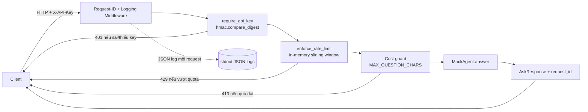

# Kiến trúc — Cloud AI Agent Starter Kit

Tài liệu này giải thích kiến trúc hiện tại của project, đối chiếu từng phần với các hạng mục trong `check_production_ready.py` (27 checks) để thấy rõ *quyết định thiết kế nào phục vụ mục tiêu production-ready nào*.

## 1. Tổng quan luồng request

Không có LLM thật — `MockAgent` là rule-based (khớp từ khóa trong `KNOWLEDGE_BASE`). Mục đích của bài lab là hạ tầng xung quanh agent, không phải bản thân model.

## 2. Thành phần và ánh xạ tới checklist

### 2.1 API layer — [app/main.py](app/main.py)

| Endpoint | Vai trò | Check tương ứng |
|---|---|---|
| `GET /health` | Liveness — process còn sống, không kiểm tra dependency | `/health endpoint exists` |
| `GET /ready` | Readiness — kiểm tra `api_key_configured`, `mock_agent_loaded`, `port_from_env` trước khi nhận traffic thật | `/ready endpoint exists` |
| `POST /ask` | Endpoint nghiệp vụ, yêu cầu auth | `/ask endpoint exists` |

**Vì sao tách `/health` và `/ready`:** orchestrator (Docker, Render, Kubernetes) dùng `/health` để quyết định có nên *restart* container không; dùng `/ready` để quyết định có nên *route traffic* vào không. Một container có thể "sống" (`/health` OK) nhưng chưa "sẵn sàng" (`/ready` fail) — ví dụ config thiếu.

**Middleware `add_request_id_and_log`:** gắn `X-Request-ID` (nhận từ client hoặc tự sinh UUID) vào mọi request/response, đo `latency_ms`, và log lại — đây là nền tảng để trace một request cụ thể qua nhiều dòng log khi debug.

### 2.2 Security — [app/security.py](app/security.py)

| Cơ chế | Chi tiết | Check tương ứng |
|---|---|---|
| API key auth | Header `X-API-Key`, so sánh bằng `hmac.compare_digest` thay vì `==` | `API key auth uses X-API-Key`, `Invalid auth returns 401` |
| Rate limit | Sliding window 60s trong bộ nhớ (`deque` theo key `api_key:client_ip`), giới hạn `RATE_LIMIT_PER_MINUTE` | `Rate limiting present` |
| Cost guard | Từ chối câu hỏi dài hơn `MAX_QUESTION_CHARS` bằng `413` | `Cost guard present` |

**Vì sao `compare_digest`:** so sánh string thường (`==`) dừng sớm ở ký tự sai đầu tiên, lộ timing side-channel cho phép brute-force từng ký tự của key. `compare_digest` so sánh trong thời gian hằng số.

**Giới hạn đã biết:** rate limiter dùng bộ nhớ tiến trình (`_REQUESTS` là dict trong RAM) — chỉ đúng khi chạy **1 instance duy nhất**. Scale ngang (nhiều container/instance) cần chuyển sang Redis hoặc rate limit ở tầng API Gateway, vì mỗi instance sẽ có bộ đếm riêng và giới hạn thực tế sẽ nhân lên theo số instance.

### 2.3 Cấu hình & secrets — [app/settings.py](app/settings.py)

`Settings` là một `frozen dataclass`, đọc toàn bộ config qua biến môi trường — không có giá trị mặc định nguy hiểm cho secret.

| Cơ chế | Chi tiết | Check tương ứng |
|---|---|---|
| Fail-fast | `_secret_env("APP_API_KEY")` raise `RuntimeError` ngay khi thiếu, thay vì chạy với key rỗng/mặc định | `Settings fail fast if APP_API_KEY is missing` |
| Secret file mount | Đọc `APP_API_KEY_FILE` trước, fallback về `APP_API_KEY` — tương thích Docker/Compose secrets và Kubernetes Secret mount dạng file | `Settings support secret file mount` |
| Port từ env | `PORT` đọc qua `_int_env`, không hardcode `8000` | `App binds to PORT env` |

**Vì sao đọc `PORT` từ env thay vì hardcode:** hầu hết PaaS (Render, Railway, Heroku, Cloud Run) tự chọn cổng nội bộ và inject qua biến `PORT`; hardcode `8000` sẽ khiến container không nhận được traffic khi platform gán một cổng khác.

### 2.4 Logging — [app/logging_config.py](app/logging_config.py)

`JsonFormatter` chuyển mỗi log record thành một dòng JSON (`ts`, `level`, `logger`, `message`, và các field động như `request_id`, `latency_ms`, `status_code`, `client`) ghi ra `stdout`.

**Vì sao JSON thay vì text thường:** log dạng JSON có thể được hệ thống log tập trung (CloudWatch, Loki, Datadog...) parse trực tiếp thành field để query/filter/alert (vd: "tất cả request có `status_code >= 500` trong 5 phút qua"), thay vì phải viết regex trên chuỗi text tự do.

→ Check tương ứng: `Structured JSON logging present`.

### 2.5 Agent — [app/agent.py](app/agent.py)

`MockAgent` là bộ trả lời rule-based dựa trên khớp từ khóa với `KNOWLEDGE_BASE` — không gọi LLM thật, không cần API key ngoài. Đây là điểm cố ý để học viên tập trung vào hạ tầng thay vì chi phí/độ trễ của LLM thật. Khi cần thay bằng LLM thật, chỉ cần thay nội dung `MockAgent.answer()`; toàn bộ auth/rate-limit/logging/deploy xung quanh giữ nguyên.

### 2.6 Container hóa — [Dockerfile](Dockerfile)

| Kỹ thuật | Chi tiết | Check tương ứng |
|---|---|---|
| Multi-stage build | Stage `builder` cài dependency vào `/opt/venv`; stage `runtime` chỉ copy venv + code, không mang theo pip cache/build tool | `Dockerfile uses multi-stage build` |
| Base image nhỏ | `python:3.12-slim` ở cả hai stage | `Dockerfile uses slim base` |
| Non-root user | Tạo user/group hệ thống `app`, `USER app` trước khi chạy | `Dockerfile defines non-root user` |
| HEALTHCHECK | Gọi `/health` mỗi 30s qua `urllib`, không cần cài `curl` thêm vào image | `Dockerfile has HEALTHCHECK` |
| Bind theo `$PORT` | `CMD` dùng `--port ${PORT:-8000}` | `App binds to PORT env` |

**Vì sao non-root:** nếu container bị compromise (vd: qua lỗ hổng dependency), tiến trình chạy với quyền hạn chế thay vì root, giảm khả năng leo thang ảnh hưởng ra ngoài container.

### 2.7 Ignore & secret hygiene — [.dockerignore](.dockerignore), [.gitignore](.gitignore)

Cả hai đều loại trừ `.env` và `secrets/` để không bao giờ secret thật bị đưa vào Git history hoặc build context của image.

→ Check tương ứng: `.dockerignore excludes .env`, `.gitignore excludes .env and secrets/`, `No obvious real OpenAI-style secret`.

### 2.8 Local parity — [docker-compose.yml](docker-compose.yml)

Đọc `APP_API_KEY` qua interpolation `${APP_API_KEY:?...}` — nếu biến không tồn tại, Compose báo lỗi và dừng ngay thay vì chạy với giá trị rỗng hoặc key demo hardcode.

→ Check tương ứng: `docker-compose reads APP_API_KEY from environment`, `docker-compose does not hardcode demo API key`.

### 2.9 Cấu hình triển khai cloud — [render.yaml](render.yaml), [railway.toml](railway.toml)

Cả hai đều: build bằng Dockerfile có sẵn, health check trỏ `/health`, và **không hardcode `APP_API_KEY`** — trên Render, key khai báo `sync: false` để bắt buộc nhập thủ công qua dashboard; trên Railway, key được set qua Variables. Đây là ranh giới rõ ràng giữa "config không nhạy cảm" (đi theo Git, có thể review) và "secret" (chỉ tồn tại trong secret store của platform).

→ Check tương ứng: `Render config exists`, `Render does not hardcode APP_API_KEY`, `Railway config exists`.

## 3. Những gì kiến trúc này **chưa** làm (giới hạn đã biết)

Các checklist hiện tại xác nhận nền tảng production cơ bản, nhưng không bao gồm:

- **Rate limit phân tán**: in-memory, sai khi chạy nhiều instance (xem 2.2).
- **Auth mạnh hơn**: API key tĩnh không hỗ trợ phân quyền/hết hạn/thu hồi theo user — production thật thường cần JWT/OAuth khi có nhiều loại người dùng.
- **Observability ngoài log**: chưa có metrics (request rate, error rate, latency percentile) hay tracing phân tán — chỉ có log text/JSON đơn lẻ trên `stdout`.
- **State/cache dùng chung**: hiện tại service hoàn toàn stateless (đúng cho việc scale ngang), nhưng nếu thêm tính năng cần session/cache (vd: hội thoại nhiều lượt), sẽ cần Redis/DB dùng chung giữa các instance thay vì bộ nhớ tiến trình.
- **LLM thật**: `MockAgent` không có cost thật, không có lỗi mạng/timeout của một LLM provider thật — cần xử lý thêm retry/fallback khi thay bằng LLM thật.

## 4. Tham chiếu

- Checklist tự động: [check_production_ready.py](check_production_ready.py)
- Hướng dẫn chạy & deploy: [README.md](README.md)
- Mẫu ghi quyết định kiến trúc: [templates/architecture_decision_record.md](templates/architecture_decision_record.md)
